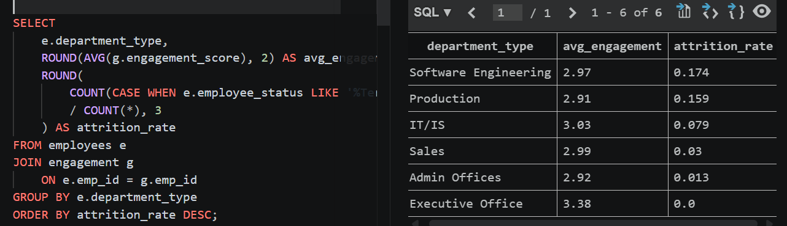

# Workforce Analytics Project Using SQL and Python

## Overview

This project analyzes employee data to identify patterns in attrition, engagement, and training across departments. The goal was to simulate a real People Analytics workflow by combining data from multiple HR related sources, validating joins, and producing business relevant insights using SQL and Python.

## Business Objective

The project was designed to answer questions such as:

- What is the overall attrition rate?
- Which departments have the highest turnover?
- Does employee engagement appear related to attrition?
- How does engagement vary across departments?
- Does training show meaningful variation across the workforce?

## Tools Used

- SQL (SQLite)
- Python (Pandas, sqlite3)
- VS Code

## Dataset Structure

The project uses three datasets joined through `emp_id`:

### 1. Employees
Main employee master table containing:
- employee status
- department
- division
- title
- demographic information
- performance score
- current employee rating

### 2. Engagement
Employee survey data containing:
- engagement score
- satisfaction score
- work life balance score

### 3. Training
Training and development data containing:
- training program name
- training type
- trainer
- training duration
- training cost

## Project Workflow

1. Cleaned column names to make them SQL friendly
2. Created SQLite tables for all three datasets
3. Loaded data into SQLite using Python
4. Validated row counts and join coverage
5. Performed exploratory SQL analysis
6. Built attrition and engagement analysis by department
7. Interpreted results from a business decision making perspective

## Key Findings

- Overall attrition rate was **12.9%**
- Highest attrition was observed in:
  - Software Engineering: **17.4%**
  - Production: **15.9%**
- Executive Office had the highest engagement score at **3.38** and zero attrition
- Production had relatively low engagement at **2.91** and high attrition
- Software Engineering had the highest attrition despite a moderate engagement score of **2.97**
- Engagement differences between active and exited employees were small, suggesting that engagement alone is not a strong predictor of turnover
- Training participation was uniform across all employees, so training was not a useful differentiator in this dataset

## Key Analysis Output

The query below analyzes average engagement and attrition rate across departments.

It highlights that Software Engineering and Production have the highest attrition despite moderate engagement levels.



## Main Business Insight

Attrition appears to be driven more by role or department specific factors than by engagement alone. Technical and frontline functions showed the highest turnover, while leadership roles showed both higher engagement and lower attrition.

## Recommendations

- Focus retention efforts on high attrition departments such as Software Engineering and Production
- Investigate non engagement drivers of attrition such as workload, compensation, and career growth
- Redesign training programs so they vary by employee need rather than being uniformly distributed
- Monitor department level engagement and turnover together instead of relying only on company wide averages

## Files Included

- `load_data.py` for loading CSV files into SQLite
- `01_create_tables.sql` for table creation
- `03_validation_checks.sql` for row count and join validation
- `05_exploratory_checks.sql` for initial analysis
- `06_attrition_analysis.sql` for attrition analysis
- `07_training_analysis.sql` for training related analysis
- `outputs/key_findings.md` for final summarized insights

## Sample Query

```sql
SELECT 
    e.department_type,
    ROUND(AVG(g.engagement_score), 2) AS avg_engagement,
    ROUND(
        COUNT(CASE WHEN e.employee_status LIKE '%Terminated%' THEN 1 END) * 1.0 
        / COUNT(*), 3
    ) AS attrition_rate
FROM employees e
JOIN engagement g
    ON e.emp_id = g.emp_id
GROUP BY e.department_type
ORDER BY attrition_rate DESC;
